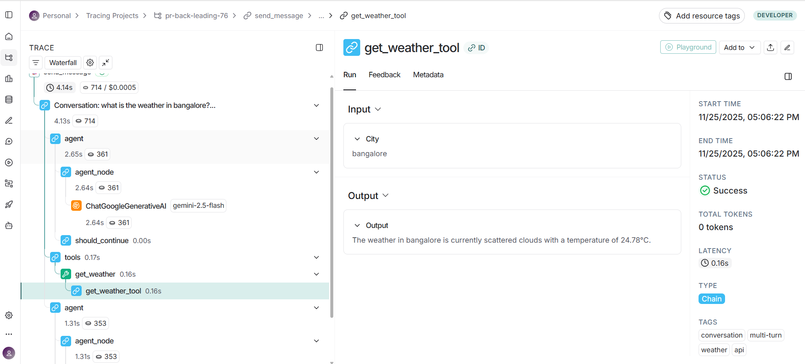
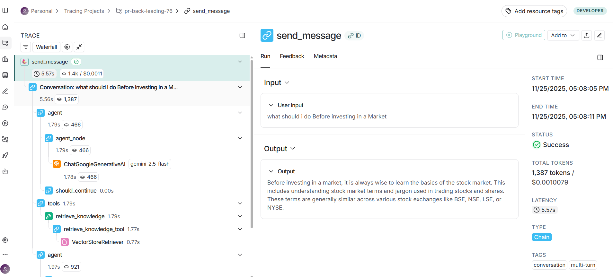
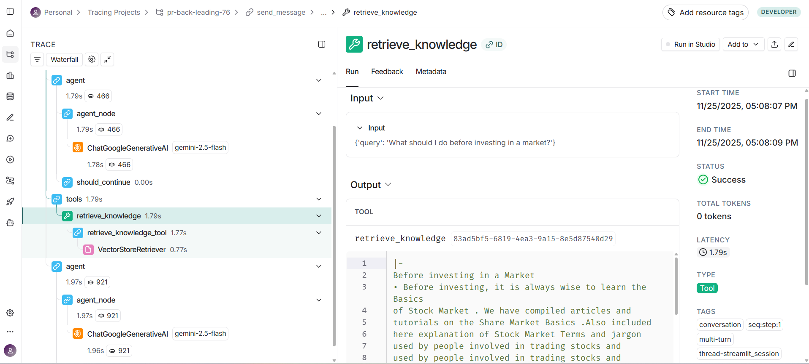

# AI-Engineer-Assignment
# AI Agent with Weather & Document QA

A conversational AI agent that fetches real-time weather data and answers questions from your PDF documents using RAG (Retrieval-Augmented Generation).

## Features

-  Real-time weather information for any city
-  Ask questions about your stock market PDF documents
-  Multi-turn conversations with context memory
-  Complete observability with LangSmith tracing
-  Clean Streamlit web interface

## Project Structure

```
AI-ENGINEER-ASSIGNMENT/
├── __pycache__/              # Python cache
├── .pytest_cache/            # Pytest cache
├── ai_env/                   # Virtual environment
├── qdrant_db/               # Vector database storage
├── app.py                   # Streamlit web interface
├── Langgraph_Agent.py       # Main agent logic
├── RAG_Model.py             # Document processing & retrieval
├── Stock Market.pdf         # Sample knowledge base
├── test_case.py             # Test suite
├── Test_logs.txt            # Test results
└── README.md                # This file
```

## Setup Instructions

### 1. Install Dependencies

```bash
pip install langchain-core langchain-google-genai langgraph
pip install langchain-community langchain-qdrant qdrant-client
pip install pypdf langsmith streamlit requests python-dotenv pytest
```

### 2. Get API Keys

You'll need three API keys:

**Google Gemini API:**
- for the LLMM task and the embedding

**OpenWeatherMap API:**
- To get weather data in real time 

**LangSmith API (Optional but recommended):**
- Needed for tracing and monitoring

### 3. Configure Environment

Create a `.env` file in the project root:

```env
# Required
GOOGLE_API_KEY=your_gemini_api_key_here
OPENWEATHERMAP_API_KEY=your_weather_api_key_here

# Optional (for tracing)
LANGCHAIN_TRACING_V2=true
LANGCHAIN_API_KEY=your_langsmith_key_here
LANGCHAIN_PROJECT=ai-agent-project
```

### 4. Prepare Your Documents

```bash
# Place your PDF in the project folder
# Then run:
python RAG_Model.py
```

This will:
- Load your PDF
- Split it into chunks
- Create embeddings
- Store in Qdrant vector database

### 5. Run the Application

**Web Interface (Recommended):**
```bash
streamlit run app.py
```

**Command Line:**
```bash
python Langgraph_Agent.py
```

## How It Works

### Architecture

The agent uses LangGraph to orchestrate different components:

1. **User Query** → Sent to the agent
2. **Agent Node** → Gemini LLM decides what to do
3. **Tool Selection** → Picks weather API or document retrieval
4. **Tool Execution** → Fetches data
5. **Response** → Formats and returns answer


## Testing

Run the test suite:

```bash
pytest test_case.py -v
```

# Test case logs:
```
========================================================================= test session starts =========================================================================
platform win32 -- Python 3.12.4, pytest-9.0.1, pluggy-1.6.0 -- C:\Users\acer\Desktop\AI_Engineer\AI-Engineer-Assignment\ai_env\Scripts\python.exe
cachedir: .pytest_cache
rootdir: C:\Users\acer\Desktop\AI_Engineer\AI-Engineer-Assignment
plugins: anyio-4.11.0, langsmith-0.4.46
collected 30 items                                                                                                                                                     

test_case.py::TestWeatherAPIHandling::test_get_weather_success PASSED                                                                                            [  3%]
test_case.py::TestWeatherAPIHandling::test_get_weather_city_not_found PASSED                                                                                     [  6%] 
test_case.py::TestWeatherAPIHandling::test_get_weather_network_error PASSED                                                                                      [ 10%] 
test_case.py::TestWeatherAPIHandling::test_get_weather_missing_api_key PASSED                                                                                    [ 13%] 
test_case.py::TestWeatherAPIHandling::test_get_weather_timeout PASSED                                                                                            [ 16%]
test_case.py::TestRAGRetrieval::test_retrieve_knowledge_success PASSED                                                                                           [ 20%] 
test_case.py::TestRAGRetrieval::test_retrieve_knowledge_no_results PASSED                                                                                        [ 23%] 
test_case.py::TestRAGRetrieval::test_retrieve_knowledge_error PASSED                                                                                             [ 26%]
test_case.py::TestRAGRetrieval::test_retrieve_knowledge_multiple_docs PASSED                                                                                     [ 30%] 
test_case.py::TestLLMProcessing::test_extract_text_from_string PASSED                                                                                            [ 33%] 
test_case.py::TestLLMProcessing::test_extract_text_from_list_of_dicts PASSED                                                                                     [ 36%] 
test_case.py::TestLLMProcessing::test_extract_text_from_mixed_list PASSED                                                                                        [ 40%] 
test_case.py::TestLLMProcessing::test_extract_text_from_empty_list PASSED                                                                                        [ 43%] 
test_case.py::TestLLMProcessing::test_extract_text_from_other_types PASSED                                                                                       [ 46%]
test_case.py::TestConversationManager::test_initialization PASSED                                                                                                [ 50%] 
test_case.py::TestConversationManager::test_clear_history PASSED                                                                                                 [ 53%] 
test_case.py::TestConversationManager::test_get_history PASSED                                                                                                   [ 56%] 
test_case.py::TestConversationManager::test_message_count_increments PASSED                                                                                      [ 60%] 
test_case.py::TestEvaluation::test_evaluate_quality_excellent_response PASSED                                                                                    [ 63%] 
test_case.py::TestEvaluation::test_evaluate_quality_empty_response PASSED                                                                                        [ 66%] 
test_case.py::TestEvaluation::test_evaluate_quality_error_response PASSED                                                                                        [ 70%] 
test_case.py::TestEvaluation::test_evaluate_quality_short_response PASSED                                                                                        [ 73%] 
test_case.py::TestEvaluation::test_evaluate_quality_long_response PASSED                                                                                         [ 76%] 
test_case.py::TestEvaluation::test_evaluate_quality_good_length PASSED                                                                                           [ 80%] 
test_case.py::TestEvaluation::test_evaluate_quality_missing_keywords PASSED                                                                                      [ 83%] 
test_case.py::TestIntegration::test_process_query_empty_input PASSED                                                                                             [ 86%]
test_case.py::TestIntegration::test_process_query_with_exception PASSED                                                                                          [ 90%] 
test_case.py::TestIntegration::test_conversation_manager_empty_input PASSED                                                                                      [ 93%] 
test_case.py::TestErrorHandling::test_weather_api_malformed_response PASSED                                                                                      [ 96%] 
test_case.py::TestErrorHandling::test_rag_retrieval_partial_failure PASSED                                                                                       [100%]

==================================================================== 30 passed in 0.42s ==================================================================== 
```

## LangSmith Integration

LangSmith provides complete visibility into agent's behavior.

### Screenshot Placeholders

#### weather tool call with trace


#### RAG tool call with trace


#### RAG Retrive the content from the vectorDB
